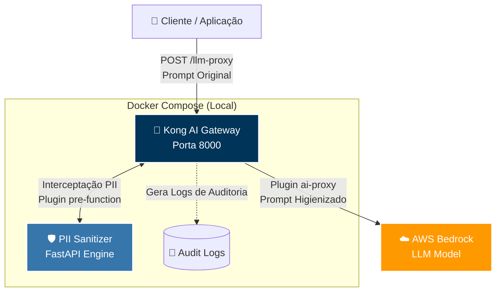
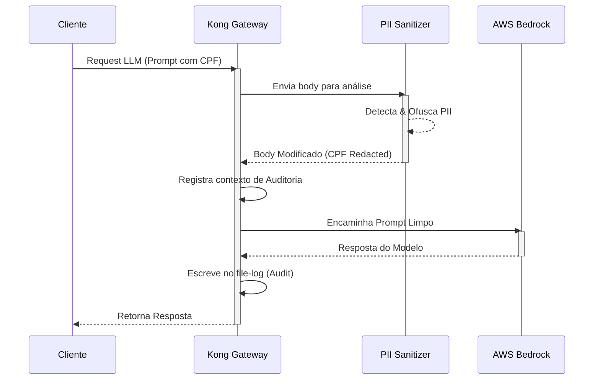

<div align="center">
  <h1>🛡️ Kong AI Gateway — PII Shield PoC</h1>
  <p><strong>Blindagem em Tempo Real de Dados Sensíveis para Modelos de IA na AWS</strong></p>
  
  <p>
    
    
    
    
  </p>
</div>

<br/>

> **Missão:** Estabelecer o Kong AI Gateway como um plano de controle centralizado (Control Plane) para chamadas de inferência a LLMs, garantindo a ofuscação nativa de Informações Pessoalmente Identificáveis (PII) — com foco em CPFs brasileiros — antes que os dados atinjam os provedores de Nuvem.

---

## 📑 Índice

- [Visão Geral](#-visão-geral)
  - [O Desafio](#o-desafio)
  - [A Solução](#a-solução)
- [Arquitetura](#-arquitetura)
  - [Estratégia Dual-Layer](#estratégia-dual-layer-agnóstica-a-licença)
  - [Fluxo de Dados](#fluxo-de-dados-sequence)
- [Funcionalidades Principais](#-funcionalidades-principais)
- [Primeiros Passos](#-primeiros-passos)
  - [Pré-requisitos](#pré-requisitos)
  - [Instalação e Execução](#instalação-e-execução)
- [Guia de Testes](#-guia-de-testes)
  - [Como Modificar os Testes](#como-modificar-e-criar-novos-testes)
- [Configuração e Customização](#-configuração-e-customização)
  - [Trocar de Modelo LLM](#trocar-de-modelo-llm)
  - [Modos de Redação PII](#modos-de-redação-pii)
- [Auditoria e Compliance (BCB 538/2025)](#-auditoria-e-compliance-bcb-5382025)
- [Troubleshooting](#-troubleshooting)

---

## 🔎 Visão Geral

### O Desafio
As aplicações corporativas modernas frequentemente integram Modelos de Linguagem (LLMs) via chamadas diretas aos SDKs dos provedores em nuvem (ex: `boto3` para AWS Bedrock). Esta arquitetura cria um **acoplamento forte** e, mais gravemente, um ponto cego de governança: dados de clientes (PII) podem vazar acidentalmente nos prompts.

Para instituições financeiras no Brasil, a **Resolução BCB nº 538/2025** exige controles prescritivos rigorosos de Prevenção de Vazamento de Dados (DLP), rastreabilidade ponta-a-ponta e governança estrita sobre fornecedores terceirizados.

### A Solução
Implementação do **Kong AI Gateway** atuando como um firewall de IA (Control Plane). Ele centraliza as conexões, padroniza as requisições e intercepta o tráfego para higienizar dados sensíveis em tempo real, garantindo que o provedor LLM nunca tenha acesso ao dado original do cliente.

---

## 🏗️ Arquitetura

### Estratégia Dual-Layer (Agnóstica a Licença)

Para garantir máxima flexibilidade, construímos uma arquitetura de duas camadas que realiza a ofuscação **mesmo sem depender exclusivamente da licença Kong Enterprise**:

1. **Camada Gateway (Kong)**: Centraliza as requisições e utiliza o plugin `ai-proxy` (Enterprise) para traduzir o padrão universal OpenAI para o formato nativo da AWS Bedrock/SageMaker.
2. **Camada Sanitizer (Custom)**: Utiliza o plugin `pre-function` (serverless, open-source) do Kong para interceptar o body da requisição HTTP *antes* dela ser roteada. O Kong encaminha o dado para um serviço independente (FastAPI), que executa a detecção regex/heurística, ofusca o PII e devolve o payload higienizado.

<div align="center">
  
</div>



### Fluxo de Dados (Sequence)



---

## ✨ Funcionalidades Principais

- 🕵️ **Detecção de PII Brasileiro**: Identificação nativa de CPFs (formatados ou numéricos, com validação de checksum), telefones (DDD + número), nomes próprios e dados financeiros.
- 🔄 **Dados Sintéticos (Synthetic Data)**: Capacidade de trocar dados sensíveis por dados falsos coerentes e matematicamente válidos (ex: um CPF falso válido) em vez de apenas placeholders.
- 🧠 **Agnóstico a LLM**: Transição entre Amazon Titan, Anthropic Claude ou Meta Llama alterando apenas uma variável de ambiente, sem mudar uma linha de código nas aplicações cliente.
- 📜 **Trilha de Auditoria BCB**: Logs granulares detalhando *quantos* e *quais tipos* de PII foram interceptados por requisição.

---

## 🚀 Primeiros Passos

### Pré-requisitos

- [Docker](https://docs.docker.com/get-docker/) e Docker Compose (v24.0+)
- [Python 3.10+](https://www.python.org/downloads/) (apenas para executar o script de teste)
- Credenciais AWS (IAM com permissões de acesso ao Bedrock)
- *(Opcional)* Licença Kong Enterprise Trial para habilitar o `ai-proxy` (Obtenha em [Kong Konnect](https://konnect.konghq.com/))

### Instalação e Execução

1. **Clone o repositório e configure as credenciais:**

```bash
git clone <repo-url>
cd kong-ai-gateway-bcb-compliance

# Crie seu arquivo de ambiente
cp .env.example .env
```

2. **Edite o arquivo `.env` com suas chaves:**
> ⚠️ **Dica:** O sistema funciona com a variável `KONG_LICENSE_DATA` vazia apenas para a etapa do PII Sanitizer, mas o teste completo ponta-a-ponta na AWS exige a licença do `ai-proxy`.

3. **Suba a infraestrutura:**

```bash
docker compose up -d --build
```

4. **Verifique a saúde dos serviços:**

```bash
# Saúde do Kong
curl -s http://localhost:8001/status | python -m json.tool

# Saúde do Sanitizer Customizado
curl -s http://localhost:8088/health | python -m json.tool
```

---

## 🧪 Guia de Testes

A PoC acompanha uma suíte de integração robusta (`test_kong_proxy.py`) com output colorido e validações estruturadas.

Instale a dependência de testes:
```bash
pip install requests
```

| Comando | O que faz | Ideal para |
|---|---|---|
| `python test_kong_proxy.py` | Executa o fluxo E2E (App → Kong → Sanitizer → AWS) | Homologação final |
| `python test_kong_proxy.py --sanitizer-only` | Testa a higienização de CPF/Nomes isoladamente, sem passar pela AWS | Ambientes sem licença ou chaves Cloud |
| `python test_kong_proxy.py --synthetic` | Ativa o modo de geração de dados falsos em vez de placeholders `[REDACTED]` | Validação de qualidade de ofuscação |

### Como Modificar e Criar Novos Testes

O script de teste é extensível. Para simular novos ataques de vazamento de dados ou testar detecção de CNPJs:

1. Edite o `test_kong_proxy.py`.
2. Localize a constante `TEST_PROMPTS` e adicione seu caso:

```python
{
    "name": "Teste Customizado: Cartão Corporativo",
    "prompt": "O diretor de TI comprou servidores usando o cartão Visa 4111 2222 3333 4444.",
    "expected_pii": ["CREDIT_CARD"], # Garanta que a regex de CREDIT_CARD existe no main.py
}
```
*Lembrete: se adicionar um novo tipo de dado (ex: `CNPJ`), certifique-se de ter adicionado a regra correspondente no regex do módulo Python (`pii-sanitizer/app/main.py`).*

---

## ⚙️ Configuração e Customização

### Trocar de Modelo LLM

A genialidade do `ai-proxy` é sua **tradução universal**. A sua aplicação envia o payload no padrão OpenAI (Chat Completions) e o Kong traduz em voo.

Para trocar a inteligência artificial, **não altere seu código**, apenas modifique o `.env`:

```env
# Amazon Titan (padrão)
AI_MODEL_NAME=amazon.titan-text-express-v1

# Ou mude para Claude 3 Sonnet:
AI_MODEL_NAME=anthropic.claude-3-sonnet-20240229-v1:0

# Ou Llama 3:
AI_MODEL_NAME=meta.llama3-70b-instruct-v1:0
```
Após alterar, aplique as mudanças no container: `docker compose restart kong-gateway`.

### Modos de Redação PII

O Sanitizer customizado aceita duas abordagens via a variável `PII_REDACT_TYPE` (no arquivo `.env`):

- `placeholder` (Default): Substitui por tokens fixos como `[REDACTED_CPF_1]`. Mais seguro para auditoria bruta.
- `synthetic`: Gera um CPF falso e válido (ex: `847.192.483-11`). Excelente para manter o LLM no contexto original sem quebrar formatações de tabela ou lógicas do prompt.

---

## 🏛️ Auditoria e Compliance (BCB 538/2025)

A Resolução BCB nº 538/2025 exige evidências concretas. Esta PoC mapeia diretamente os controles:

| 🛡️ Controle Exigido (BCB) | ⚙️ Como Atendemos na Arquitetura |
|---|---|
| **DLP (Prevenção de Vazamento)** | Interceptação e bloqueio de PII brasileiro no gateway antes de chegar à Nuvem. |
| **Rastreabilidade Transacional** | Headers `X-Request-ID` e `file-log` auditando o volume e os tipos de entidades sanitizadas. |
| **Governança sobre Terceiros** | O Control Plane centralizado impede que provedores AWS recebam os dados originais do cliente. |
| **Criptografia em Trânsito** | O Kong suporta terminação TLS Edge-to-Edge nativamente. |

### Visualizando Evidências de Auditoria

Os logs são estruturados em JSON para fácil integração com plataformas SIEM (Splunk, Datadog, Elastic).

```bash
# Ver as interceptações PII brutas do Kong:
docker compose exec kong-gateway cat /tmp/kong-audit.log | grep pii_sanitizer | jq
```

*Exemplo de registro no sistema de logs:*
```json
"pii_sanitizer": {
  "pii_identified": 3,
  "pii_types": {
    "NAME": 1,
    "CPF": 1,
    "MONEY": 1
  },
  "redact_type": "placeholder",
  "timestamp": 1719245100.123
}
```

---

## 🛠️ Troubleshooting

**O LLM retorna erro HTTP 503:**
O plugin `ai-proxy` está sem licença Enterprise. Insira sua chave trial no `KONG_LICENSE_DATA` ou execute apenas o teste isolado da camada Sanitizer: `python test_kong_proxy.py --sanitizer-only`.

**O PII Sanitizer não está ofuscando CPFs:**
Verifique se a requisição original está saindo no formato correto (OpenAI Chat Completions). O interceptor Lua foi desenhado especificamente para buscar o texto sensível dentro do array `messages[].content`.

**Erros de Credencial AWS (401/403):**
Garanta que as varíaveis `AWS_ACCESS_KEY_ID` e `AWS_SECRET_ACCESS_KEY` no `.env` possuam acesso válido e a policy `bedrock:InvokeModel` anexada.

---
<div align="center">
  <p><i>Desenvolvido como Prova de Conceito para Adequação Regulatória do SFN (BCB 538/2025).</i></p>
</div>
