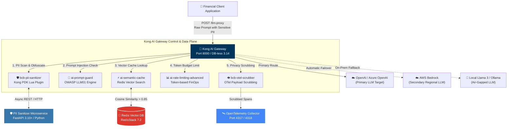
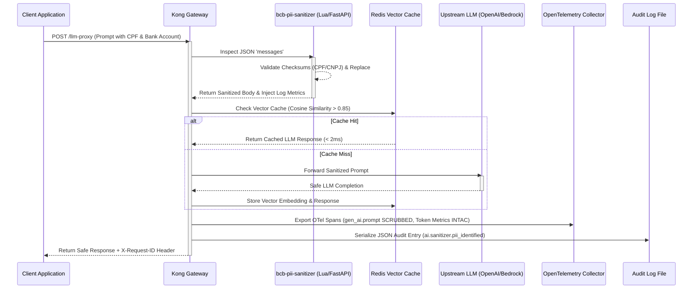

<div align="center">
  <h1>🛡️ Kong AI Gateway — BCB Regulatory Compliance & Guardrail Engine</h1>
  <p><strong>Production-Grade AI Control Plane & Data Plane for Financial Institutions</strong></p>
  <p><i>Strict Governance under Resolution BCB CMN 4893/21 and BCB 85/21</i></p>
  
  <p>
    
    
    
    
    
    
  </p>
</div>

<br/>

> **Executive Objective:** Deploy an enterprise-grade **Kong AI Gateway** acting as an intelligent AI Control Plane and Data Plane to proxy, secure, orchestrate, and observe Large Language Model (LLM) traffic. Crucially, the solution natively enforces Brazilian Central Bank compliance (**Resolução CMN 4893/21** and **BCB 85/21**) regarding cloud contracting, incident tracking, data residency, and the **CIA Triad** (Confidentiality, Integrity, Availability).

---

## 📑 Table of Contents

- [Executive Summary & Strategic Context](#-executive-summary--strategic-context)
- [System Architecture & Topology](#-system-architecture--topology)
  - [Control Plane & Data Plane Topology](#control-plane--data-plane-topology)
  - [Sequence Flow & PII Interception](#sequence-flow--pii-interception)
- [OWASP Top 10 for LLM Applications (2025) Mitigation Matrix](#-owasp-top-10-for-llm-applications-2025-mitigation-matrix)
- [Directory Structure Mapping](#-directory-structure-mapping)
- [Key Architectural Features](#-key-architectural-features)
  - [1. Brazilian PII Obfuscation & Synthetic Generation (Confidentiality)](#1-brazilian-pii-obfuscation--synthetic-generation-confidentiality)
  - [2. Multi-Provider LLM Abstraction & Automatic Failover (Availability)](#2-multi-provider-llm-abstraction--automatic-failover-availability)
  - [3. OpenTelemetry GenAI Privacy Scrubbing (The AI Visibility Paradox)](#3-opentelemetry-genai-privacy-scrubbing-the-ai-visibility-paradox)
  - [4. FinOps: Redis Vector Search Semantic Caching & Token Rate Limiting](#4-finops-redis-vector-search-semantic-caching--token-rate-limiting)
- [Getting Started](#-getting-started)
  - [Prerequisites](#prerequisites)
  - [Environment Configuration](#environment-configuration)
  - [Deployment](#deployment)
- [Testing & Quality Assurance Suite](#-testing--quality-assurance-suite)
- [Audit & Regulatory Log Verification (BCB 85/21)](#-audit--regulatory-log-verification-bcb-8521)
- [Architecture Decision Records (ADRs)](#-architecture-decision-records-adrs)

---

## 🔎 Executive Summary & Strategic Context

Financial institutions subject to Brazilian Central Bank governance face stringent operational and technical requirements when adopting Generative AI and cloud-hosted Large Language Models (LLMs):

1. **Resolução CMN nº 4.893/21**: Regulates cybersecurity policies, cloud contracting, data residency, operational continuity, and incident management.
2. **Resolução BCB nº 85/21**: Defines protocols for data classification, governance, and regulatory incident reporting.

Direct application coupling to public LLM endpoints (e.g., OpenAI, AWS Bedrock) exposes financial institutions to severe risks:
- **Confidentiality Breach**: Unsanitized customer PII (CPFs, CNPJs, bank account details, monetary amounts) transmitted across national boundaries.
- **Availability Outages**: Single-vendor dependencies violating operational continuity requirements.
- **Unbounded Consumption**: Cost overruns due to malicious or runaway LLM token requests (OWASP LLM10:2025).

This repository provides a complete, cloud-native blueprint demonstrating how **Kong AI Gateway** functions as an **AI Control Plane and Firewall**, enforcing real-time guardrails, multi-provider failover, semantic caching, token rate limiting, and privacy-scrubbed OpenTelemetry traces.

---

## 🏗️ System Architecture & Topology

### Control Plane & Data Plane Topology


```mermaid
graph TD
    Client[📱 Financial Client Application] -->|POST /llm-proxy<br>Raw Prompt with Sensitive PII| Kong[🦍 Kong AI Gateway<br>Port 8000 / DB-less 3.14]

    subgraph KongControlPlane ["Kong AI Gateway Control & Data Plane"]
        Kong -->|1. PII Scan & Obfuscate| LuaPII[🛡️ bcb-pii-sanitizer<br>Kong PDK Lua Plugin]
        Kong -->|2. Prompt Injection Check| PromptGuard[🚧 ai-prompt-guard<br>OWASP LLM01 Engine]
        Kong -->|3. Vector Cache Lookup| SemanticCache[⚡ ai-semantic-cache<br>Redis Vector Search]
        Kong -->|4. Token Budget Limit| RateLimit[📊 ai-rate-limiting-advanced<br>Token-based FinOps]
        Kong -->|5. Privacy Scrubbing| OTelScrubber[👁️ bcb-otel-scrubber<br>OTel Payload Scrubbing]
    end

    LuaPII <-->|Async REST / HTTP| FastPII[🛡️ PII Sanitizer Microservice<br>FastAPI 3.10+ / Python]
    SemanticCache <-->|Cosine Similarity > 0.85| Redis[(🔴 Redis Vector DB<br>RedisStack 7.2)]
    OTelScrubber -->|Scrubbed Spans| OTelCollector[🛰️ OpenTelemetry Collector<br>Port 4317 / 4318]

    Kong -->|Primary Route| OpenAI["☁️ OpenAI / Azure OpenAI<br>(Primary LLM Target)"]
    Kong -.->|Automatic Failover| Bedrock["☁️ AWS Bedrock<br>(Secondary Regional LLM)"]
    Kong -.->|On-Prem Fallback| Ollama["🏢 Local Llama 3 / Ollama<br>(Air-Gapped LLM)"]

    classDef kong fill:#003459,stroke:#fff,stroke-width:2px,color:#fff;
    classDef redis fill:#DC382D,stroke:#fff,stroke-width:2px,color:#fff;
    classDef python fill:#3776AB,stroke:#fff,stroke-width:2px,color:#fff;
    classDef otel fill:#4285F4,stroke:#fff,stroke-width:2px,color:#fff;

    class Kong kong;
    class Redis redis;
    class FastPII python;
    class OTelCollector otel;
```

### Sequence Flow & PII Interception


```mermaid
sequenceDiagram
    participant App as Client Application
    participant Kong as Kong Gateway
    participant PII as bcb-pii-sanitizer (Lua/FastAPI)
    participant Redis as Redis Vector Cache
    participant LLM as Upstream LLM (OpenAI/Bedrock)
    participant OTel as OpenTelemetry Collector
    participant Log as Audit Log File

    App->>Kong: POST /llm-proxy (Prompt with CPF & Bank Account)
    activate Kong
    Kong->>PII: Inspect JSON 'messages'
    activate PII
    PII-->>PII: Validate Checksums (CPF/CNPJ) & Replace
    PII-->>Kong: Return Sanitized Body & Inject Log Metrics
    deactivate PII

    Kong->>Redis: Check Vector Cache (Cosine Similarity > 0.85)
    alt Cache Hit
        Redis-->>Kong: Return Cached LLM Response (< 2ms)
    else Cache Miss
        Kong->>LLM: Forward Sanitized Prompt
        activate LLM
        LLM-->>Kong: Safe LLM Completion
        deactivate LLM
        Kong->>Redis: Store Vector Embedding & Response
    end

    Kong->>OTel: Export OTel Spans (gen_ai.prompt SCRUBBED, Token Metrics INTAC)
    Kong->>Log: Serialize JSON Audit Entry (ai.sanitizer.pii_identified)
    Kong-->>App: Return Safe Response + X-Request-ID Header
    deactivate Kong
```

---

## 🔒 OWASP Top 10 for LLM Applications (2025) Mitigation Matrix

| OWASP Vulnerability | Risk Scenario | Mitigation Mechanism in Gateway |
|---|---|---|
| **LLM01: Prompt Injection** | Malicious jailbreaks overriding system prompts. | Enforced via `ai-prompt-guard` semantic regex guardrails and `bcb-pii-sanitizer` interception. |
| **LLM02: Sensitive Information Disclosure** | Unsanitized prompt data leaking to public models or APM traces. | Dual-layer `bcb-pii-sanitizer` (CPF/CNPJ/bank accounts) + `bcb-otel-scrubber` (redacts prompt text in traces). |
| **LLM06: Excessive Agency** | Downstream LLMs invoking unauthorized financial APIs. | Dynamic policy routing and least-privilege token scope enforcement in Kong Gateway. |
| **LLM10: Unbounded Consumption** | Denial of Wallet attacks causing budget exhaustion. | `ai-rate-limiting-advanced` enforcing strict limits on input and output token counts (`gen_ai.usage.*`). |

---

## 📁 Directory Structure Mapping

```text
kong-ai-gateway-bcb-compliance/
├── .github/
│   └── workflows/
│       └── ci-cd.yml                 # GitHub Actions pipeline (Pongo, Pytest, k6)
├── config/
│   ├── kong.yaml                     # decK v3.0 declarative API Gateway configuration
│   └── otel-collector-config.yml     # OpenTelemetry Collector configuration
├── docs/
│   └── adr/
│       ├── 0001-bcb-compliance-architecture.md   # ADR: BCB CMN 4893/21 & BCB 85/21
│       └── 0002-otel-genai-privacy-scrubbing.md   # ADR: OTel GenAI telemetry scrubbing
├── plugins/
│   ├── bcb-pii-sanitizer/            # Custom Kong Lua Plugin: PII Interception
│   │   └── kong/plugins/bcb-pii-sanitizer/
│   │       ├── handler.lua
│   │       └── schema.lua
│   └── bcb-otel-scrubber/             # Custom Kong Lua Plugin: OTel Privacy Scrubbing
│       └── kong/plugins/bcb-otel-scrubber/
│           ├── handler.lua
│           └── schema.lua
├── pii-sanitizer/                     # Python 3.10+ FastAPI PII Microservice & MLOps Engine
│   ├── app/
│   │   ├── __init__.py
│   │   ├── main.py                   # FastAPI app with RFC 7807 problem details
│   │   ├── pii_engine.py             # Checksum engines (CPF/CNPJ) & synthetic generators
│   │   └── schemas.py                # Pydantic request/response & RFC 7807 models
│   ├── tests/
│   │   └── test_sanitizer.py         # Pytest async testing suite
│   ├── Dockerfile
│   └── requirements.txt
├── spec/                             # Kong Lua Plugin Busted Test Suite
│   ├── 01-bcb-otel-scrubber_spec.lua
│   └── 02-bcb-pii-sanitizer_spec.lua
├── tests/
│   └── k6/
│       └── llm_benchmark.js          # k6 load benchmarking (TPS, TTFT, Latency)
├── .env.example                      # Environment variables template
├── docker-compose.yml                # HA local cluster definition (Kong, Redis, PII, OTel)
├── test_kong_proxy.py                # E2E compliance & integration verification script
└── README.md                         # Technical documentation
```

---

## ✨ Key Architectural Features

### 1. Brazilian PII Obfuscation & Synthetic Generation (Confidentiality)
Native detection targeting:
- **CPF Numbers**: Formatted (`123.456.789-00`) and raw numeric (`12345678900`) validated via mathematical checksum algorithm (`_validate_cpf_digits`).
- **CNPJ Numbers**: Formatted (`11.222.333/0001-81`) and raw numeric validated via two-digit checksum verification (`_validate_cnpj_digits`).
- **Financial Account Details**: Agência, Conta Corrente, and PIX references.
- **Monetary Amounts**: Currency expressions (e.g., `R$ 50.000,00`).
- **Modes**:
  - `placeholder`: Replaces items with `[REDACTED_CPF_1]`, `[REDACTED_BANK_ACCOUNT_1]`.
  - `synthetic`: Dynamically generates mathematically valid fake credentials to maintain reasoning context for the LLM.

#### Ingress Message Coverage & Labelled Non-Goal (Response Body Scrubbing)
- **Universal Role & Structure Coverage**: Ingress inspection scans all message roles (`system`, `user`, `assistant`, `developer`, `tool`) and traverses both standard string content and OpenAI structured array content parts (`[{type="text", text=...}]`), rewriting sensitive tokens in-place.
- **Labelled Non-Goal (Response Body Scrubbing)**:
  - **Technical Rationale**: In OpenResty/Nginx, the `body_filter_by_lua` phase executes in a streaming chunk filter context where network cosockets are disabled (`API disabled in the context of body_filter`). Invoking an external microservice like `pii-sanitizer` from `body_filter` is architecturally prohibited. Additionally, modern LLM inference relies on Server-Sent Events (SSE) streaming (`stream: true`), where token fragments arrive across arbitrary TCP boundaries; buffering or reconstructing partial streams degrades Time-To-First-Token (TTFT) latency and risks breaking SSE protocol framing.
  - **Residual Risk & Mitigation**: The residual risk is model-echoed PII. Under BCB CMN 4893/21 and BCB 85/21, strict ingress perimeter control guarantees that no customer PII reaches external models, eliminating the source material for model-echoed data leaks. Pure in-memory Lua response filtering for non-streaming endpoints is reserved for future extensions.

### 2. Multi-Provider LLM Abstraction & Automatic Failover (Availability)
Implements dynamic upstream fallback paths:
1. **Primary**: OpenAI / Azure OpenAI
2. **Secondary**: AWS Bedrock (Titan / Claude 3)
3. **Tertiary**: Local Llama 3 via Ollama (Air-gapped / On-premises)

### 3. OpenTelemetry GenAI Privacy Scrubbing (The AI Visibility Paradox)
Solves the paradox of needing operational visibility without leaking customer data:
- **Scrubbed**: `gen_ai.prompt` and `gen_ai.completion` replaced with `[REDACTED_BY_BCB_COMPLIANCE_POLICY]`.
- **Preserved**: `gen_ai.system`, `gen_ai.request.model`, `gen_ai.usage.input_tokens`, `gen_ai.usage.output_tokens`, `kong.latency`, `upstream.latency`.

### 4. FinOps: Redis Vector Search Semantic Caching & Token Rate Limiting
- **Semantic Cache**: Uses Redis Vector Search (cosine similarity > 0.85). Identical semantic queries return cached responses in sub-milliseconds, dramatically reducing cloud LLM invocation expenses.
- **Token Rate Limiting**: Restricts consumption based on LLM input/output token counts (`gen_ai.usage.input_tokens`, `gen_ai.usage.output_tokens`), mitigating Denial of Wallet vulnerabilities.

---

## 🚀 Getting Started

### Prerequisites
- [Docker](https://docs.docker.com/get-docker/) & Docker Compose (v24.0+)
- [Python 3.10+](https://www.python.org/downloads/)

### Environment Configuration
Copy `.env.example` to `.env`:
```bash
cp .env.example .env
```

### Deployment
Spin up the complete high-availability sandbox cluster:
```bash
docker compose up -d --build
```
Verify readiness endpoints:
```bash
# Gateway Operational Status
curl -s http://localhost:8001/status

# PII Sanitizer Health Check
curl -s http://localhost:8088/health
```

---

## 🧪 Testing & Quality Assurance Suite

The repository contains three comprehensive test suites:

### 1. Python Pytest Microservice Suite
```bash
pip install -r pii-sanitizer/requirements.txt pytest httpx
pytest pii-sanitizer/tests/ -v
```

### 2. Python E2E Integration Verification
```bash
python test_kong_proxy.py
```

### 3. k6 Performance & Latency Benchmark
```bash
k6 run tests/k6/llm_benchmark.js
```

---

## 🏛️ Audit & Regulatory Log Verification (BCB 85/21)

Kong Gateway serializes all compliance audit entries to `/tmp/audit-logs/kong-audit.log`.

### Example Compliance Audit Record:
```json
{
  "ai": {
    "sanitizer": {
      "pii_identified": 3,
      "pii_sanitized": 3,
      "pii_types": ["NAME", "CPF", "BANK_ACCOUNT"]
    }
  },
  "bcb": {
    "compliance": {
      "otel_scrubbed": true,
      "policy": "CMN_4893_21_BCB_85_21"
    }
  },
  "request": {
    "headers": {
      "x-request-id": "f81d4fae-7dec-11d0-a765-00a0c91e6bf6"
    }
  },
  "latencies": {
    "kong": 4,
    "proxy": 120
  }
}
```

---

## 📑 Architecture Decision Records (ADRs)

- [ADR 0001: BCB CMN 4893/21 & BCB 85/21 Compliance Architecture](docs/adr/0001-bcb-compliance-architecture.md)
- [ADR 0002: OpenTelemetry GenAI Privacy Scrubbing](docs/adr/0002-otel-genai-privacy-scrubbing.md)

---
<div align="center">
  <p><i>Engineered in compliance with SFN Financial Regulations (BCB CMN 4893/21 & BCB 85/21).</i></p>
</div>
