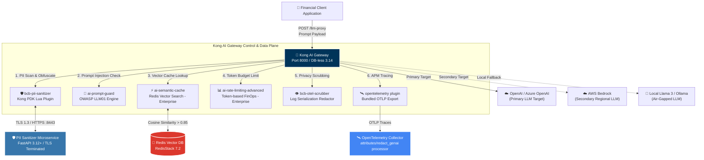
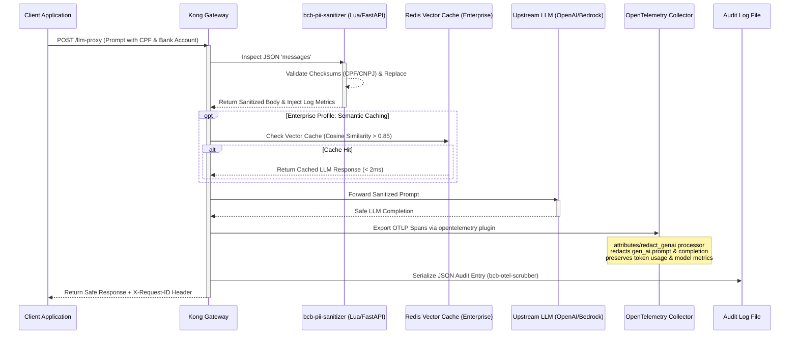

<div align="center">
  <h1>🛡️ Kong AI Gateway — BCB Regulatory Controls & Guardrail Engine</h1>
  <p><strong>Reference Architecture & Technical Control Building Blocks for Financial Institutions</strong></p>
  <p><i>Technical Control Implementation Supporting Resolution CMN 4.893/2021 & Resolution BCB 85/2021</i></p>
  
  <p>
    
    
    
    
    
    
  </p>
</div>

<br/>

> [!WARNING]
> ### ⚖️ Technical Control Building Blocks — NOT a Compliance Certification
> **Requires Qualified Legal Review.**  
> This repository provides an open-source technical reference architecture and gateway control building blocks. Use of this software does **not** constitute, certify, or guarantee regulatory compliance under Brazilian Central Bank (Banco Central do Brasil - BCB) or National Monetary Council (CMN) regulations. Regulatory compliance is an institutional property requiring qualified legal counsel, formal vendor risk assessments, operational incident tracking, business continuity planning, and adherence to institutional security policies.

<br/>

> **Technical Objective:** Deploy an enterprise-grade **Kong AI Gateway** acting as an AI Control Plane and Data Plane to proxy, secure, orchestrate, and observe Large Language Model (LLM) traffic. The solution implements technical control building blocks designed to support institutional compliance programs under Brazilian financial regulations (**Resolução CMN nº 4.893/2021**, as amended by **Resolução CMN nº 5.274/2025**, and **Resolução BCB nº 85/2021**) regarding cybersecurity policies, cloud contracting, telemetry privacy, and the **CIA Triad** (Confidentiality, Integrity, Availability).

---

## 📑 Table of Contents

- [Executive Summary & Strategic Context](#-executive-summary--strategic-context)
- [System Architecture & Topology](#-system-architecture--topology)
  - [Control Plane & Data Plane Topology](#control-plane--data-plane-topology)
  - [Sequence Flow & PII Interception](#sequence-flow--pii-interception)
- [OWASP Top 10 for LLM Applications (2025) Mitigation Matrix](#-owasp-top-10-for-llm-applications-2025-mitigation-matrix)
- [Directory Structure Mapping](#-directory-structure-mapping)
- [Key Architectural Features](#-key-architectural-features)
  - [1. Brazilian PII Obfuscation & Synthetic Generation (Confidentiality)](#1-brazilian-pii-obfuscation--synthetic-generation-confidentiality)
  - [2. Multi-Provider LLM Abstraction (Availability)](#2-multi-provider-llm-abstraction-availability)
  - [3. OpenTelemetry GenAI Privacy Scrubbing (The AI Visibility Paradox)](#3-opentelemetry-genai-privacy-scrubbing-the-ai-visibility-paradox)
  - [4. FinOps: Redis Vector Search Semantic Caching & Token Rate Limiting](#4-finops-redis-vector-search-semantic-caching--token-rate-limiting)
- [Open-Source (OSS) vs. Enterprise Feature Matrix](#-open-source-oss-vs-enterprise-feature-matrix)
- [Getting Started](#-getting-started)
  - [Prerequisites](#prerequisites)
  - [Environment Configuration](#environment-configuration)
  - [Deployment via Docker Compose Profiles](#deployment-via-docker-compose-profiles)
  - [Readiness & Health Verification](#readiness--health-verification)
  - [Admin Plane & Transport Security Hardening](#-admin-plane--transport-security-hardening-cmn-48932021)
- [Testing & Quality Assurance Suite](#-testing--quality-assurance-suite)
- [Audit & Regulatory Log Verification](#-audit--regulatory-log-verification)
- [Architecture Decision Records (ADRs)](#-architecture-decision-records-adrs)

---

## 🔎 Executive Summary & Strategic Context

Financial institutions and payment institutions subject to Central Bank of Brazil governance face strict operational, confidentiality, and technical requirements when adopting Generative AI and cloud-hosted Large Language Models (LLMs):

1. **Resolução CMN nº 4.893/2021** (published 2021-02-26, effective 2021-07-01; amended by **Resolução CMN nº 5.274/2025**): Establishes cybersecurity policies and mandatory requirements for contracting data processing, storage, and cloud computing services for financial institutions authorized by the BCB.
   - *Note on Data Residency*: CMN 4.893/2021 does **not** mandate domestic data hosting; it permits cross-border cloud contracting provided institutions ensure regulatory oversight, full auditability, business continuity, and prior communication to the regulator. Ingress PII redaction serves as a technical confidentiality control, but is **not** a legal substitute for cloud contracting compliance.
2. **Resolução BCB nº 85/2021** (published 2021-04-08, effective 2021-07-01): Establishes cybersecurity policies and requirements for contracting data processing, storage, and cloud computing services specifically for **Payment Institutions** (*Instituições de Pagamento*) authorized by the BCB.

Direct application coupling to public LLM endpoints (e.g., OpenAI, AWS Bedrock) exposes financial organizations to significant risks:
- **Confidentiality Breach**: Unsanitized customer PII (CPFs, CNPJs, bank account details, monetary amounts) transmitted across network boundaries to third-party model providers.
- **Availability Outages**: Single-vendor dependencies violating operational continuity requirements.
- **Unbounded Consumption**: Cost overruns due to runaway LLM token requests (OWASP LLM10:2025).

This repository provides an open-source technical reference architecture demonstrating how **Kong AI Gateway** functions as an **AI Control Plane and Firewall**, enforcing real-time guardrails, provider abstraction, semantic caching, token rate limiting, and privacy-scrubbed OpenTelemetry traces.

---

## 🏗️ System Architecture & Topology

### Control Plane & Data Plane Topology


```mermaid
graph TD
    Client[📱 Financial Client Application] -->|POST /llm-proxy<br>Prompt Payload| Kong[🦍 Kong AI Gateway<br>Port 8000 / DB-less 3.14]

    subgraph KongControlPlane ["Kong AI Gateway Control & Data Plane"]
        Kong -->|1. PII Scan & Obfuscate| LuaPII[🛡️ bcb-pii-sanitizer<br>Kong PDK Lua Plugin]
        Kong -->|2. Prompt Injection Check| PromptGuard[🚧 ai-prompt-guard<br>OWASP LLM01 Engine]
        Kong -->|3. Vector Cache Lookup| SemanticCache[⚡ ai-semantic-cache<br>Redis Vector Search - Enterprise]
        Kong -->|4. Token Budget Limit| RateLimit[📊 ai-rate-limiting-advanced<br>Token-based FinOps - Enterprise]
        Kong -->|5. Privacy Scrubbing| OTelScrubber[👁️ bcb-otel-scrubber<br>Log Serialization Redactor]
        Kong -->|6. APM Tracing| KongOTel[🛰️ opentelemetry plugin<br>Bundled OTLP Export]
    end

    LuaPII <-->|TLS 1.3 / HTTPS :8443| FastPII[🛡️ PII Sanitizer Microservice<br>FastAPI 3.12+ / TLS Terminated]
    SemanticCache <-->|Cosine Similarity > 0.85| Redis[(🔴 Redis Vector DB<br>RedisStack 7.2)]
    KongOTel -->|OTLP Traces| OTelCollector[🛰️ OpenTelemetry Collector<br>attributes/redact_genai processor]

    Kong -->|Primary Target| OpenAI["☁️ OpenAI / Azure OpenAI<br>(Primary LLM Target)"]
    Kong -.->|Secondary Target| Bedrock["☁️ AWS Bedrock<br>(Secondary Regional LLM)"]
    Kong -.->|Local Fallback| Ollama["🏢 Local Llama 3 / Ollama<br>(Air-Gapped LLM)"]

    classDef kong fill:#003459,stroke:#fff,stroke-width:2px,color:#fff;
    classDef redis fill:#DC382D,stroke:#fff,stroke-width:2px,color:#fff;
    classDef python fill:#3776AB,stroke:#fff,stroke-width:2px,color:#fff;
    classDef otel fill:#4285F4,stroke:#fff,stroke-width:2px,color:#fff;

    class Kong kong;
    class Redis redis;
    class FastPII python;
    class OTelCollector otel;
```

### Sequence Flow & PII Interception


```mermaid
sequenceDiagram
    participant App as Client Application
    participant Kong as Kong Gateway
    participant PII as bcb-pii-sanitizer (Lua/FastAPI)
    participant Redis as Redis Vector Cache (Enterprise)
    participant LLM as Upstream LLM (OpenAI/Bedrock)
    participant OTel as OpenTelemetry Collector
    participant Log as Audit Log File

    App->>Kong: POST /llm-proxy (Prompt with CPF & Bank Account)
    activate Kong
    Kong->>PII: Inspect JSON 'messages'
    activate PII
    PII-->>PII: Validate Checksums (CPF/CNPJ) & Replace
    PII-->>Kong: Return Sanitized Body & Inject Log Metrics
    deactivate PII

    opt Enterprise Profile: Semantic Caching
        Kong->>Redis: Check Vector Cache (Cosine Similarity > 0.85)
        alt Cache Hit
            Redis-->>Kong: Return Cached LLM Response (< 2ms)
        end
    end

    Kong->>LLM: Forward Sanitized Prompt
    activate LLM
    LLM-->>Kong: Safe LLM Completion
    deactivate LLM

    Kong->>OTel: Export OTLP Spans via opentelemetry plugin
    Note over OTel: attributes/redact_genai processor<br/>redacts gen_ai.prompt & completion<br/>preserves token usage & model metrics
    Kong->>Log: Serialize JSON Audit Entry (bcb-otel-scrubber)
    Kong-->>App: Return Safe Response + X-Request-ID Header
    deactivate Kong
```

---

## 🔒 OWASP Top 10 for LLM Applications (2025) Mitigation Matrix

| OWASP Vulnerability | Risk Scenario | Mitigation Mechanism in Gateway |
|---|---|---|
| **LLM01: Prompt Injection** | Malicious jailbreaks overriding system instructions. | Evaluated via `ai-prompt-guard` semantic regex guardrails and `bcb-pii-sanitizer` interception. |
| **LLM02: Sensitive Information Disclosure** | Unsanitized prompt data leaking to public models or APM traces. | Multi-tier `bcb-pii-sanitizer` (CPF/CNPJ checksum validation, bank accounts) + `bcb-otel-scrubber` (log serialization) + OpenTelemetry Collector `attributes/redact_genai` processor (spans). |
| **LLM06: Excessive Agency** | Downstream LLMs invoking unauthorized financial APIs. | Least-privilege token scope enforcement and endpoint isolation in Kong Gateway. |
| **LLM10: Unbounded Consumption** | Denial of Wallet attacks causing financial budget exhaustion. | `ai-rate-limiting-advanced` enforcing limits on input and output token counts (`gen_ai.usage.*`) (*Enterprise feature*). |

---

## 📁 Directory Structure Mapping

```text
kong-ai-gateway-bcb-compliance/
├── .github/
│   └── workflows/
│       └── ci-cd.yml                 # GitHub Actions pipeline (Pongo, Pytest, k6)
├── config/
│   ├── kong.yaml                     # Baseline declarative API Gateway configuration
│   ├── kong.oss.yaml                 # License-free Open Source profile configuration
│   ├── kong.enterprise.yaml          # Kong Enterprise profile configuration
│   └── otel-collector-config.yml     # OpenTelemetry Collector configuration
├── docs/
│   ├── adr/
│   │   ├── 0001-bcb-compliance-architecture.md   # ADR: BCB CMN 4893/21 & BCB 85/21 Controls
│   │   └── 0002-otel-genai-privacy-scrubbing.md   # ADR: OTel GenAI telemetry scrubbing
│   └── baseline-reproduction.md      # Baseline reproduction & verification evidence
├── plugins/
│   ├── bcb-pii-sanitizer/            # Custom Kong Lua Plugin: PII Interception
│   │   └── kong/plugins/bcb-pii-sanitizer/
│   │       ├── handler.lua
│   │       └── schema.lua
│   └── bcb-otel-scrubber/             # Custom Kong Lua Plugin: OTel Privacy Scrubbing
│       └── kong/plugins/bcb-otel-scrubber/
│           ├── handler.lua
│           └── schema.lua
├── pii-sanitizer/                     # Python 3.12 FastAPI PII Microservice
│   ├── app/
│   │   ├── __init__.py
│   │   ├── main.py                   # FastAPI app with RFC 7807 problem details
│   │   ├── pii_engine.py             # Checksum-gated engines (CPF/CNPJ) & synthetic generators
│   │   └── schemas.py                # Pydantic request/response & RFC 7807 models
│   ├── certs/                        # Self-signed dev certificates for TLS encryption
│   ├── tests/
│   │   └── test_sanitizer.py         # Pytest async test suite
│   ├── Dockerfile
│   └── requirements.txt
├── spec/                             # Kong Lua Plugin Busted Test Suite
│   ├── 01-bcb-otel-scrubber_spec.lua
│   └── 02-bcb-pii-sanitizer_spec.lua
├── tests/
│   └── k6/
│       └── llm_benchmark.js          # k6 load benchmarking (TPS, TTFT, Latency)
├── .env.example                      # Environment variables template
├── docker-compose.yml                # Dual-profile local cluster definition (OSS & Enterprise)
├── test_kong_proxy.py                # E2E compliance & integration verification script
└── README.md                         # Technical documentation
```

---

## ✨ Key Architectural Features

### 1. Brazilian PII Obfuscation & Synthetic Generation (Confidentiality)
Targeted detection with mathematical validation:
- **CPF Numbers**: Formatted (`123.456.789-00`) and raw numeric strings (`12345678900`) validated via mathematical checksum algorithm (`_validate_cpf_digits`). Raw 11-digit numbers that fail checksum are preserved to prevent false positives on order IDs and phone numbers.
- **CNPJ Numbers**: Formatted (`11.222.333/0001-81`) and raw numeric strings validated via two-digit checksum verification (`_validate_cnpj_digits`).
- **Financial Account Details**: Agência, Conta Corrente, and PIX references.
- **Monetary Amounts**: Brazilian currency expressions (e.g., `R$ 50.000,00`).
- **Modes**:
  - `placeholder`: Replaces items with `[REDACTED_CPF_1]`, `[REDACTED_BANK_ACCOUNT_1]`.
  - `synthetic`: Generates mathematically valid synthetic credentials to maintain semantic context for the LLM.
- **Heuristic Boundaries**: Regex and checksum algorithms provide a robust defensive layer against accidental data transmission, but do not provide mathematical guarantees against adversarial or highly ambiguous unstructured text.

#### Ingress Message Coverage & Labelled Non-Goal (Response Body Scrubbing)
- **Universal Role & Structure Coverage**: Ingress inspection scans all message roles (`system`, `user`, `assistant`, `developer`, `tool`) and traverses both standard string content and OpenAI structured array content parts (`[{type="text", text=...}]`), rewriting sensitive tokens in-place.
- **Labelled Non-Goal (Response Body Scrubbing)**:
  - **Technical Rationale**: In OpenResty/Nginx, the `body_filter_by_lua` phase executes in a streaming chunk filter context where network cosockets are disabled (`API disabled in the context of body_filter`). Invoking an external microservice like `pii-sanitizer` from `body_filter` is architecturally prohibited. Additionally, modern LLM inference relies on Server-Sent Events (SSE) streaming (`stream: true`), where token fragments arrive across arbitrary TCP boundaries; buffering partial streams degrades Time-To-First-Token (TTFT) latency and risks breaking SSE protocol framing.
  - **Residual Risk & Mitigation**: The residual risk is model-echoed PII. Strict ingress perimeter control ensures customer PII does not reach external models, eliminating the source material for model-echoed data leaks. Pure in-memory Lua response filtering for non-streaming endpoints is reserved for future extensions.

### 2. Multi-Provider LLM Abstraction (Availability)
Kong Gateway `ai-proxy` provides unified multi-provider abstraction across different LLM backends:
1. **Primary**: OpenAI / Azure OpenAI
2. **Secondary**: AWS Bedrock (Titan / Claude 3)
3. **Tertiary**: Local Llama 3 via Ollama (Air-gapped / On-premises)

*Architectural Boundary Note*: `ai-proxy` abstracts provider routing and API formatting. However, automated seamless runtime failover between heterogeneous providers with differing parameter schemas and response formats requires external orchestration or custom plugins not fully implemented in this base gateway configuration.

### 3. OpenTelemetry GenAI Privacy Scrubbing (The AI Visibility Paradox)
Addresses the paradox of needing operational visibility without exporting customer text to third-party telemetry systems via a two-tier defense-in-depth architecture:
- **APM Distributed Tracing (OTel Spans)**: Kong Gateway exports OTLP spans via the bundled `opentelemetry` plugin to `http://otel-collector:4318/v1/traces`. The OpenTelemetry Collector Contrib pipeline applies the `attributes/redact_genai` processor to programmatically replace `gen_ai.prompt` and `gen_ai.completion` with `[REDACTED_BY_BCB_COMPLIANCE_POLICY]` before spans exit to APM backends (Jaeger, Tempo, Datadog).
- **Gateway Log Serialization (Audit Sinks)**: The companion `bcb-otel-scrubber` Lua plugin redacts `gen_ai.prompt` and `gen_ai.completion` inside Kong's log serialization dictionary (`kong.log.set_serialize_value`), safeguarding file logs and audit dumps.
- **Operational & FinOps Metrics Preserved**: `gen_ai.system`, `gen_ai.request.model`, `gen_ai.usage.input_tokens`, `gen_ai.usage.output_tokens`, `kong.latency`, `upstream.latency`.

### 4. FinOps: Redis Vector Search Semantic Caching & Token Rate Limiting
- **Semantic Cache (`ai-semantic-cache`)**: Uses Redis Vector Search (cosine similarity > 0.85). Identical semantic queries return cached responses in sub-milliseconds, reducing cloud LLM invocation expenses (*Requires Kong Enterprise*).
- **Token Rate Limiting (`ai-rate-limiting-advanced`)**: Restricts consumption based on LLM input/output token counts (`gen_ai.usage.input_tokens`, `gen_ai.usage.output_tokens`), mitigating Denial of Wallet vulnerabilities (*Requires Kong Enterprise*).

---

## ⚖️ Open-Source (OSS) vs. Enterprise Feature Matrix

To avoid licensing friction and ensure reproducible evaluation, the repository separates declarative gateway configurations into a license-free **OSS profile** and an **Enterprise overlay**:

| Plugin / Capability | Kong Edition | License Required? | Dependencies | Profile |
|---|---|---|---|---|
| **`bcb-pii-sanitizer`** | Community (OSS) & Enterprise | ❌ No (Free) | `pii-sanitizer` microservice | `oss`, `enterprise` |
| **`bcb-otel-scrubber`** | Community (OSS) & Enterprise | ❌ No (Free) | Kong Gateway log phase | `oss`, `enterprise` |
| **`opentelemetry`** | Community (OSS) & Enterprise | ❌ No (Free) | `otel-collector` (Contrib) | `oss`, `enterprise` |
| **`ai-prompt-guard`** | Community (OSS) & Enterprise | ❌ No (Free) | None | `oss`, `enterprise` |
| **`ai-proxy`** | Community (OSS) & Enterprise | ❌ No (Free) | Upstream LLM / Mock | `oss`, `enterprise` |
| **`correlation-id`** | Community (OSS) & Enterprise | ❌ No (Free) | None | `oss`, `enterprise` |
| **`file-log`** | Community (OSS) & Enterprise | ❌ No (Free) | Local filesystem volume | `oss`, `enterprise` |
| **`ai-semantic-cache`** | **Enterprise Only** (min 3.8) | ⚠️ **Yes** (`KONG_LICENSE_DATA`) | `redis-vector` + OpenAI embeddings | `enterprise` |
| **`ai-rate-limiting-advanced`** | **Enterprise Only** (min 3.7) | ⚠️ **Yes** (`KONG_LICENSE_DATA`) | `redis-vector` | `enterprise` |

> [!IMPORTANT]
> **Evaluation Profile Reality**: The core technical controls (dual-layer PII interception, prompt guardrails, fail-closed enforcement, and telemetry scrubbing) run **100% offline without a commercial license** via the **`oss` profile** using the mock LLM backend. The advanced FinOps caching and token rate-limiting capabilities are segregated into the **`enterprise` profile** and require an active Kong Enterprise license.

---

## 🚀 Getting Started

### Prerequisites
- [Docker](https://docs.docker.com/get-docker/) & Docker Compose (v24.0+)
- [Python 3.11+](https://www.python.org/downloads/)

### Environment Configuration
Copy `.env.example` to `.env`:
```bash
cp .env.example .env
```

### Deployment via Docker Compose Profiles

#### 1. Open-Source Profile (Recommended for Evaluation & Testing)
Boots Kong Community Edition (`kong:3.14`) without requiring any commercial license:
```bash
docker compose --profile oss up -d --build
```
Includes: `kong-gateway-oss`, `pii-sanitizer`, `otel-collector`.

#### 2. Enterprise Profile (Full FinOps & Token Rate-Limiting Suite)
Requires a valid `KONG_LICENSE_DATA` in your `.env` file:
```bash
docker compose --profile enterprise up -d --build
```
Includes: `kong-gateway-enterprise`, `pii-sanitizer`, `otel-collector`, `redis-vector`.

### Readiness & Health Verification
```bash
# 1. Gateway Operational Status (Admin API is hardened to container loopback only)
docker exec -it kong-gateway-oss kong health
# Or via internal container curl:
docker exec -it kong-gateway-oss curl -s http://127.0.0.1:8001/status

# 2. PII Sanitizer Health Check (TLS Encrypted Transport)
curl -k https://localhost:8088/health
# Verify plaintext rejection (confirms encryption in transit):
curl http://localhost:8088/health # (Rejected / Handshake failure)

# 3. Data Plane Proxy Ingress
curl -i -X POST http://localhost:8000/llm-proxy \
  -H "Content-Type: application/json" \
  -d '{"messages": [{"role": "user", "content": "Hello"}]}'
```

### 🔒 Admin Plane & Transport Security Hardening (CMN 4.893/2021)
- **Zero World-Reachable Admin Plane**: In accordance with cybersecurity best practices under CMN 4.893/2021, Kong's Admin API (`8001`, `8444`) and Kong Manager GUI (`8002`) are bound to loopback `127.0.0.1` and removed from host published ports. Administrative operations require internal container access (`docker exec`) or private management network routing. For Enterprise deployments, RBAC enforcement (`KONG_ENFORCE_RBAC: on`) is documented.
- **Encrypted Kong ↔ Sanitizer Transport**: Sensitive financial prompt payloads are encrypted in transit between Kong Gateway and the PII Sanitizer microservice using TLS (`https://pii-sanitizer:8443`). Uvicorn terminates TLS via self-signed dev certificates in local sandbox mode, and mutual TLS (mTLS) with internal banking CA verification (`ssl_verify: true`) is the production target.

---

## 🧪 Testing & Quality Assurance Suite

The repository contains three test suites:

### 1. Python Pytest Microservice Suite
```bash
pip install -r pii-sanitizer/requirements.txt pytest httpx
pytest pii-sanitizer/tests/ -v
```

### 2. Python E2E Integration Verification
```bash
python test_kong_proxy.py
```

### 3. k6 Performance & Latency Benchmark
```bash
k6 run tests/k6/llm_benchmark.js
```

---

## 🏛️ Audit & Regulatory Log Verification

Kong Gateway serializes structured audit records to `/tmp/audit-logs/kong-audit.log`.

> [!NOTE]
> **Audit Integrity & Non-Repudiation Notice**:
> Gateway file logs written to a local filesystem mount are mutable. Production deployments requiring legal non-repudiation must forward audit streams via secure shippers (e.g., Fluent Bit, Logstash) to off-host, tamper-evident WORM (Write Once, Read Many) storage (e.g., AWS S3 Object Lock, Azure Immutable Blob) or centralized SIEM platforms.

### Example Structured Audit Record:
```json
{
  "ai": {
    "sanitizer": {
      "pii_identified": 3,
      "pii_sanitized": 3,
      "pii_types": ["NAME", "CPF", "BANK_ACCOUNT"]
    }
  },
  "bcb": {
    "compliance": {
      "otel_scrubbed": true,
      "policy": "CMN_4893_21_BCB_85_21"
    }
  },
  "request": {
    "headers": {
      "x-request-id": "f81d4fae-7dec-11d0-a765-00a0c91e6bf6"
    }
  },
  "latencies": {
    "kong": 4,
    "proxy": 120
  }
}
```

---

## 📑 Architecture Decision Records (ADRs)

- [ADR 0001: Architecture Reference for Brazilian Central Bank (CMN 4.893/2021 & BCB 85/2021) Technical Controls](docs/adr/0001-bcb-compliance-architecture.md)
- [ADR 0002: OpenTelemetry GenAI Privacy Scrubbing & Telemetry Preservation](docs/adr/0002-otel-genai-privacy-scrubbing.md)

---
<div align="center">
  <p><i>Technical reference architecture and control building blocks for SFN institutions. Requires qualified legal and regulatory review.</i></p>
</div>
