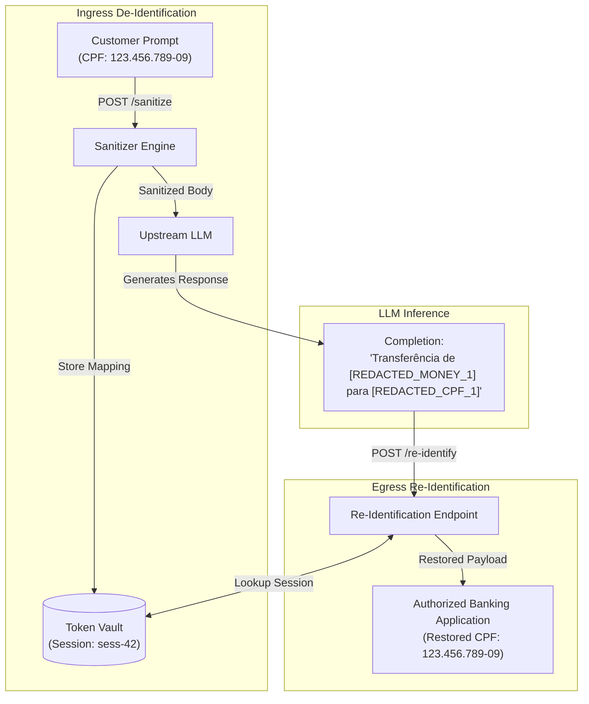

# ADR 0004: Reversible Tokenization Vault & Egress Re-Identification

## Status
Accepted

## Context
Under Brazilian Central Bank cybersecurity regulations (**Resolução CMN nº 4.893/2021** and **Resolução BCB nº 85/2021**) and data privacy laws (**LGPD — Lei nº 13.709/2018**), financial customer PII must be de-identified before dispatch to external cloud-hosted Large Language Models (LLMs).

However, real-world banking and customer service workflows frequently require **bidirectional de-identification / re-identification**:
1. **Ingress Phase**: A customer query contains sensitive financial identifiers (e.g., CPF, bank account, PIX key, monetary amounts). The gateway intercepts and substitutes them with indexed placeholder tokens (`[REDACTED_CPF_1]`) or deterministic synthetic values.
2. **LLM Processing Phase**: The upstream model processes the sanitized context and generates a decision, recommendation, or customer communication referencing the replacement tokens or synthetic identities.
3. **Egress Phase**: Authorized internal banking microservices (e.g., customer mobile backend, core banking transaction ledger, CRM) receive the model completion and must reconstruct the authentic customer data before delivering the final notification or executing financial transfers.

Previously, `pii-sanitizer` operated purely as a one-way redaction service. Once an entity was sanitized, there was no standardized interface to reverse the transformation, forcing downstream teams to build ad-hoc, error-prone regex token re-mappers.

## Decision

We implement a **bounded, thread-safe Reversible Tokenization Vault** (`TokenVault`) with a dedicated `POST /re-identify` (aliased to `POST /de-anonymize`) endpoint in the `pii-sanitizer` microservice.

### Architecture

### Key Technical Mechanisms

1. **Bidirectional Session Mapping (`SessionVault`)**:
   - `forward_map`: Maps normalized canonical keys (`CPF:12345678909`) to assigned synthetic/placeholder values for prompt consistency.
   - `reverse_map`: Maps replacement tokens (`[REDACTED_CPF_1]`, synthetic values) directly back to authentic values (`123.456.789-09`).
2. **Safe Substring Replacement**:
   - Replacements are sorted in descending order of string length prior to substitution, eliminating partial substring collision risks (e.g., `[REDACTED_CPF_10]` being partially matched by `[REDACTED_CPF_1]`).
3. **Thread Safety & LRU Eviction**:
   - Managed via `TokenVault` using Python's `threading.Lock` and `collections.OrderedDict`.
   - Default capacity is bounded to 1,000 active sessions, automatically evicting the least recently accessed sessions to avoid memory exhaustion.
4. **Session Boundary Isolation**:
   - Tokens generated in `session-A` cannot be de-anonymized by callers providing `session-B`, guaranteeing multi-tenant security.
5. **Standardized Error Contracts**:
   - Compliant with RFC 7807 Problem Details (`400 Bad Request` for empty text, `404 Not Found` if mock guards are triggered).

## Consequences

### Positive
- **Closed-Loop Privacy**: Banking applications can safely invoke external AI models and restore authentic customer context seamlessly upon completion return.
- **Zero Substring Mutilation**: Length-sorted replacement prevents token index truncation errors.
- **Zero External Dependencies**: Operates in-memory by default, requiring no database setup for local testing while remaining interface-compatible with Redis-backed distributed vaults in enterprise deployments.

### Negative & Mitigations
- **Memory Consumption**: Storing session mappings in memory consumes RAM. *Mitigation: Strict LRU bounds (`max_sessions=1000`) and explicit session reset endpoint (`POST /mock-llm/reset`).*
- **Egress Authorization**: Calling `/re-identify` restores sensitive PII. *Mitigation: Protected behind mTLS and Kubernetes network policies within the internal banking cluster.*
