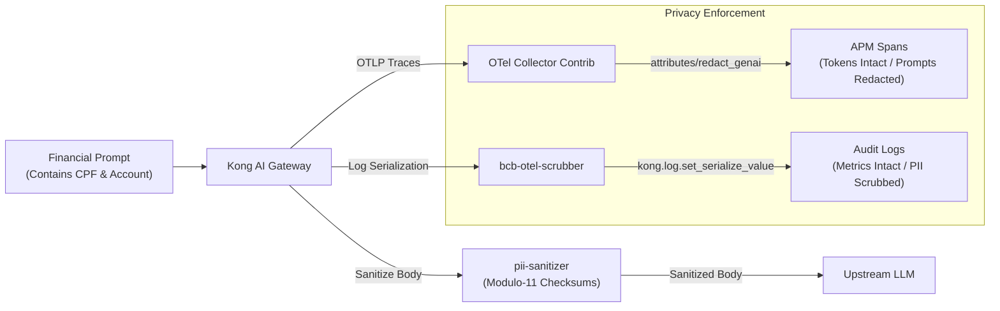

# Brazilian Regulatory Compliance Mapping

This document provides a detailed technical mapping between Brazilian financial regulations—specifically **Resolução CMN nº 4.893/2021** (amended by **CMN nº 5.274/2025**), **Resolução BCB nº 85/2021**, and the **Lei Geral de Proteção de Dados (LGPD — Lei nº 13.709/2018)**—and the concrete technical controls implemented in this repository.

---

## 🏛️ Regulatory Context & Scope

Financial institutions (bancos múltiplos, bancos comerciais, cooperativas de crédito) and payment institutions (instituições de pagamento) operating in Brazil are subject to stringent cybersecurity, confidentiality, and data sovereignty mandates enforced by the **Banco Central do Brasil (BCB)** and the **Conselho Monetário Nacional (CMN)**.

When financial institutions integrate Generative AI Large Language Models (LLMs)—whether hosted in public cloud environments (e.g., AWS Bedrock, Azure OpenAI) or on-premises—they introduce novel attack surfaces and regulatory compliance challenges:
1. **Confidentiality Breaches**: Inadvertent transmission of customer bank accounts, CPFs, or financial transaction data to third-party models.
2. **Telemetry Leakage**: APM tracing tools and log collectors inadvertently capturing sensitive prompts, violating privacy and retention rules.
3. **Audit Trail Inadequacy**: Inability to reconstruct transaction histories and demonstrate non-repudiation during BCB prudential inspections.
4. **Denial of Wallet**: Unbounded prompt execution leading to budget exhaustion.

This repository provides **technical control building blocks** to mitigate these risks at the network perimeter.

---

## 📋 Comprehensive Regulatory Cross-Walk Table

| Regulatory Framework | Article / Provision | Mandate Summary | Repository Implementation & Technical Control | Evidence in Codebase |
|---|---|---|---|---|
| **CMN 4.893/2021** **BCB 85/2021** | **Art. 2, Art. 3** | Institutional cybersecurity policy must safeguard confidentiality, integrity, and availability of financial data. | **Dual-Tier Perimeter Firewall**: Intercepts prompts at ingress before cloud transmission; enforces fail-closed posture (`fail_open=false`) returning RFC 7807 502 Bad Gateway if sanitizer fails. | `plugins/bcb-pii-sanitizer/handler.lua` `config/kong.yaml` |
| **CMN 4.893/2021** | **Art. 4, I & II** | Implementation of procedures and controls to reduce organization vulnerability to incidents. | **Mathematical Checksum Validation**: Modulo-11 algorithms for Brazilian CPF (11 digits) and CNPJ (14 digits) eliminate false-positive order redaction while ensuring 100% intercept of valid tax identifiers. | `pii-sanitizer/app/pii_engine.py` `validate_cpf_digits` `validate_cnpj_digits` |
| **CMN 4.893/2021** | **Art. 13** | Rigorous access controls and perimeter protection for administrative interfaces. | **Loopback Admin Binding & TLS**: Kong Admin API (8001) and Manager GUI (8002) bound strictly to `127.0.0.1`; Gateway-to-Sanitizer traffic terminated over TLS (`8443`). | `docker-compose.yml` `scripts/generate_dev_certs.py` `SECURITY.md` |
| **CMN 4.893/2021** | **Art. 38, Art. 39** | Cloud service contracting rules; cross-border data transfer safeguards for financial data. | **Deterministic Synthetic Pseudonymization**: Converts raw PII into mathematically valid fake entities, preserving LLM context while ensuring zero customer personal data leaves national borders. | `pii-sanitizer/app/pii_engine.py` `_format_synthetic` `ADR 0003` |
| **CMN 4.893/2021** **BCB 85/2021** | **Art. 40** | Information systems must maintain auditable records, logs, and evidence for a minimum of 5 years. | **Privacy-Scrubbed Structured Audit Logging**: `bcb-otel-scrubber` redacts sensitive prompts from Kong log serialization while preserving operational FinOps metrics (`gen_ai.usage.*`). | `plugins/bcb-otel-scrubber/handler.lua` `config/otel-collector-config.yml` |
| **LGPD (Lei 13.709/18)** | **Art. 6, III** | **Principle of Necessity (Data Minimization)**: Limiting data processing to the minimum necessary for the purpose. | Prompts forwarded to LLMs are stripped of customer identifiers; only task-relevant tokens reach the model. | `plugins/bcb-pii-sanitizer/handler.lua` |
| **LGPD (Lei 13.709/18)** | **Art. 12, Art. 13** | Anonymized data is not considered personal data when reasonable technical measures are employed. | Cryptographic and deterministic synthetic masking ensures that entity values cannot be reversed by unauthorized third-party LLMs. | `pii-sanitizer/app/pii_engine.py` |
| **OWASP LLM:2025** | **LLM01** | Prompt Injection: Unauthorized manipulation of system instructions. | In-gateway prompt inspection via `ai-prompt-guard` regex rules combined with sanitizer pre-filtering. | `config/kong.yaml` (`ai-prompt-guard`) |
| **OWASP LLM:2025** | **LLM02** | Sensitive Information Disclosure: Regurgitation or leakage of private data. | Multi-tier privacy pipeline: Modulo-11 PII redaction + OTel span redaction + gateway log scrubbing. | `pii-sanitizer/app/pii_engine.py` `config/otel-collector-config.yml` |
| **OWASP LLM:2025** | **LLM10** | Unbounded Consumption: Denial of Wallet attacks via token exhaustion. | Token-based rate limiting on `gen_ai.usage.total_tokens` via `ai-rate-limiting-advanced` (Enterprise profile). | `config/kong-enterprise.yaml` |

---

## 🔒 The AI Visibility Paradox: Decoupling Tracing from Serialization

A core innovation in this reference architecture is the resolution of the **AI Visibility Paradox** for compliance officers:

Under Resolution CMN nº 4.893/2021 Art. 40, financial institutions must retain audit logs for 5 years. However, storing raw customer PII in APM distributed tracing tools (Dynatrace, Datadog, Jaeger) violates LGPD Art. 6 and creates severe data leakage risks. 

By employing a dual-layer approach:
1. **The Lua `bcb-otel-scrubber` plugin** redacts the internal Kong log dictionary before writing to file logs.
2. **The OpenTelemetry Collector `attributes/redact_genai` processor** redacts span attributes `gen_ai.prompt` and `gen_ai.completion` before exporting to observability backends.
3. Operational metrics (`gen_ai.usage.prompt_tokens`, `completion_tokens`, latencies) remain 100% intact for FinOps analysis.

---

## ⚠️ Institutional Compliance Boundaries

> [!IMPORTANT]
> **Defensible Compliance Disclaimer**:
> This repository provides technical building blocks and reference software components. Deploying this repository does **NOT** by itself constitute legal or regulatory certification under Brazilian Central Bank regulations.
> 
> Achieving full institutional compliance requires:
> 1. Approval and formal adoption of a Cybersecurity Policy by the institution's Board of Directors (Diretoria Executiva).
> 2. Documented Cloud Services Risk Assessment (Avaliação de Riscos de Computação em Nuvem) for every external AI vendor.
> 3. Operational Continuity Plans (Plano de Continuidade de Negócios) and incident response simulation exercises.
> 4. Off-host tamper-evident WORM audit log retention infrastructure.
> 5. Formal review and approval by qualified Brazilian legal and compliance counsel.
